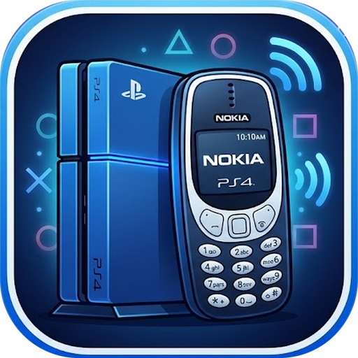

<p align="center">
  
</p>

<h1 align="center">PSNokia</h1>

<p align="center">
  Play classic Java phone games on your PS4.
</p>

Remember the games on Nokia and other phones from the 2000s, like Bounce,
Tower Bloxx, or Gameloft's Rayman and Sonic? PSNokia runs those Java
(J2ME) games on a jailbroken PS4, played with the DualShock 4 on your TV.

Each game installs as its own app on the PS4 home screen, with its own
icon and its own saves.

## Features

- **Runs the original games.** Use the game's `.jar` file as it is.
- **Music and sound effects**, including the old Nokia ringtone-style
  sounds.
- **Controller rumble** when the game makes the phone vibrate.
- **Touchscreen games**, played with the DS4 touchpad.
- **3D games** made with the phones' 3D graphics support.
- **Saves** kept separately for each game.
- **Your choice of picture:** keep the phone's shape, stretch to fill the
  TV, and smooth out jagged pixels.

## Which games work?

See the **[compatibility list](COMPATIBILITY.md)**. Games tested so far
include Sonic Advance, Rayman 3, Tower Bloxx, City Bloxx and Bounce, and
all of them are playable.

## What you need

- A jailbroken PS4 with [GoldHEN](https://github.com/GoldHEN/GoldHEN)
- The game's `.jar` file. No games are included; use games you own.
- A Windows PC, to turn the game into a PS4 package (see below)

## Adding a game

Each game becomes its own PS4 package (`.pkg`). For now you make it on a
PC, after building PSNokia (see [Building](#building)):

```bash
ps4/package/make_game.sh path/to/game.jar "Game Title" PSNK00001 176x208
```

- **Game Title** is the name shown on the PS4 home screen.
- **PSNK00001** is the game's ID: 4 letters and 5 digits, different for
  every game (PSNK00002 for the next one, and so on).
- **176x208** is the screen size the game was made for. Leave it out for
  the common 240x320. Early Nokia games are often 128x128 and Nokia's
  Series 60 games 176x208. The [compatibility list](COMPATIBILITY.md) has
  the size for each tested game. If a game sits in a corner of the screen
  or is cut off, try another size.

The package is saved in `ps4/out/games/PSNK00001/`. Copy it to your PS4 and
install it like any other package, for example with GoldHEN's package
installer.

## Controls

| DS4 | Phone key |
|---|---|
| Cross | Select / fire (the middle key) |
| Circle | Right soft key: Back / Exit |
| Square, Options | Left soft key: OK / Options / Menu |
| D-pad | 2 / 4 / 6 / 8 (up, left, right, down) |
| Left stick | Arrow keys |
| Triangle | 0 |
| L2 / R2 / L3 / R3 | 1 / 3 / 7 / 9 |
| Touchpad | Touchscreen (see below) |
| Hold L1 or R1 | Cross = 5, Square = *, Circle = #, Triangle = Clear |

As on a Nokia phone, the soft key labels appear in the bottom corners of
the screen. Circle usually goes back; on a game's main menu it quits.

### Touchscreen games

The touchpad works as the phone's touchscreen. Put a finger on it and a
cursor appears over the game; click the touchpad to tap there, and keep it
clicked while sliding your finger to drag (for example, to pull back a
slingshot).

### Picture settings

| DS4 | What it does |
|---|---|
| L1 + Options | Change the shape: **fit** (the phone's shape), **4:3**, **full** (fills the whole TV), **pixel** (every pixel the same size) |
| L1 + Touchpad | Switch between **sharp** pixels and **smooth** edges |

Each game remembers its own settings.

## Questions

**Can it run N-Gage games?**
No. N-Gage games are not Java games; they are programs for the phone's own
system (Symbian), which PSNokia doesn't run.

**Where are my saves?**
On the PS4 in `/data/psnokia/<game ID>`, for example
`/data/psnokia/PSNK00001`. They stay when you reinstall the game.

**A game runs slowly.**
Many phone games were made to run at 15 to 20 frames per second, so some
slowness is normal.

## Building

For developers. Everything builds on Windows from an MSYS2 shell, and
needs:

- The [OpenOrbis PS4 toolchain](https://github.com/OpenOrbis/OpenOrbis-PS4-Toolchain)
  (tested with v0.5.4) and LLVM/clang 18
- MSYS2 with the 32-bit MinGW gcc (`mingw-w64-i686-gcc`)
- JDK 6 (e.g. Zulu 6) and JDK 8
- The .NET runtime, for the toolchain's `PkgTool.Core`
- Optional: Python with Pillow, to make each game's icon from its own

Set the tool locations in [ps4/env.sh](ps4/env.sh) if they differ from the
defaults, then run:

```bash
ps4/build_all.sh
```

This makes the optimized build used for playing. For finding problems,
`PSNOKIA_BUILD=debug` makes a much slower build that checks more and logs
every Java exception; set it for `make_game.sh` too.

PSNokia is a port of **phoneME**, Sun's open-source Java runtime for
phones.

## License

phoneME is licensed under the GNU General Public License version 2, as
stated at the top of its source files, and so are the changes in this
repository.
dlmalloc (`ps4/common/dlmalloc`) is by Doug Lea under an MIT-style license.
